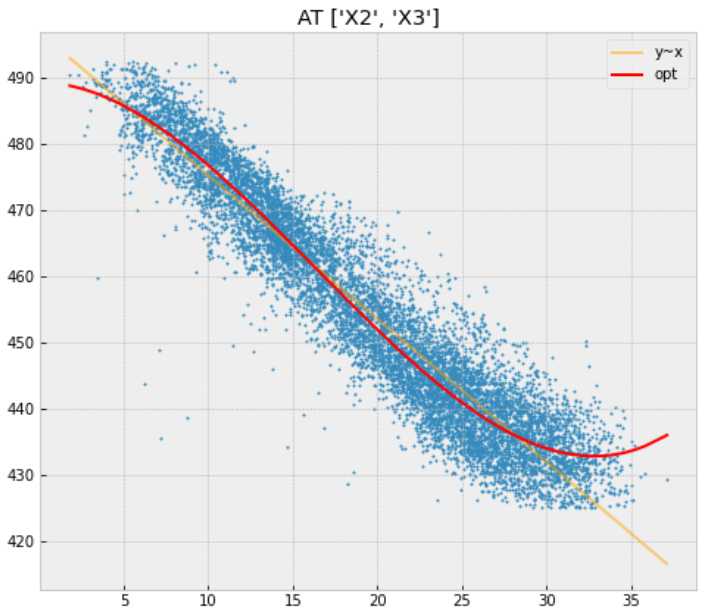
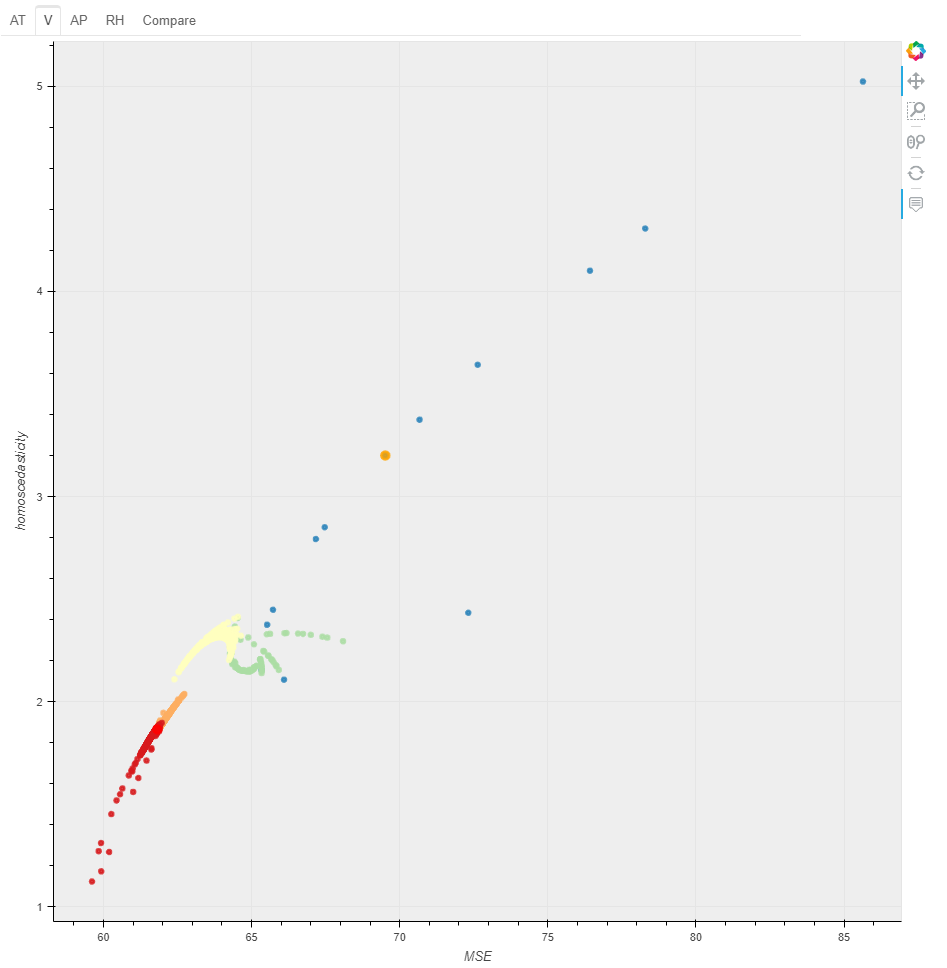

# regVariableConversion



## Regression = linear regression?
Absolutly not.  
But it's really rare case to assume variables combination from domain knowlege.  
RVC supports "finding better formula for explanatory variable and object variable".

## What is regVariableConversion(RVC)?
'regVariableConversion' is a Python library for searching "appropriate" variables combination in regression method. Dataset itself is supported multivariate data but relationship between independent variables and dependent variables is one by one. So this library doesn't support interaction effect.

## How to use RVC
```
dfx = pd.read_csv("data.csv")
RVC = rvc()
out = RVC.fit(dfx, "object name")
```
That's it.
```
out
```

| formula | col_origin |
----|---- 
| Y ~ + np.square(X0) + np.power(X0, 3) | AT |
| Y ~ + np.log(X1) + np.reciprocal(X1) + np.sqrt(X1) + np.sqrt(np.log(X1))  | V |
| Y ~ + np.power(X2, 3) | AP |
| Y ~ + X3:np.log(X3) | RH |

## Support formula
[1]. $\ x, \ x^2, \ x^3, \ \frac{1}{x}, \ \frac{1}{x^2}$  

[2]. $\ \sqrt{x}, \ x\sqrt{x}$

[3]. $\ logx, \ xlogx, \ x^2logx, \ \frac{logx}{x}, \ \sqrt{logx}, \ \sqrt{xlogx}$

## Search area
You can specify limitation of factor combination.  
For example, you specify 5. Each factor combination is following (in default formula).  

  

In total, it is 3952 combination by only 5 factors.

## Decision algorithm
This package suggest "best" combination, which doesn't mean most highest fitting.  
In increasing factor number, fitting score also goes up in even terreble fittng.

Currently, the decision is being made on multiple indicatorson by staged structure.  
Basic idea is followings 

- If the fitting is bad, won't increase the number of elements.
- As the number of factors increases, getting to place importance on homoscedasticity.

## SubFunction
+ CSV output  
It can extract all combination costs in dataframe.

+ Sliding Function  
If data includes the number can't be converted like log, it'll be slided.

+ Regression plot  
You can see how it is improved [matplotlib]

+ Cost plot  
All combination result are plotted [bokeh]



## Dependencies
- [Statsmodels](https://github.com/statsmodels/statsmodels)

