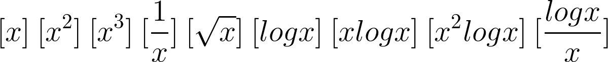
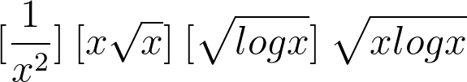

# regVariableConversion

'regVariableConversion' is a Python library for searching "appropriate" variables combination in regression method. Dataset itself is supported multivariate data but relationship between independent variables and dependent variables is one by one. So this library doesn't support interaction effect.

## CHECKLIST
- bug in smaller combination number

## TODO
- add test for plot
- ~~pandas >> numpy maybe~~
- store calculation flow of decision function to plot
- store changepoint calculation result
- indicate how much calculation will be done

## IMPROVE
- flexible input of new formula

## Important links
- High dependence library: [statsmodels](https://github.com/statsmodels/statsmodels)

## Dependencies

## Idea
[statsmodels.formula.api.smf](https://www.statsmodels.org/stable/examples/notebooks/generated/formulas.html?highlight=formula) allows flexible variable combination. By calculating all combination it can find ideal one.

## Support formula
### <> default formula

### <> optional formula
coming later with function to custom

## Basic usage

## Decision algorithm

## SubFunction
+ Sliding Function  
If data includes the number can't be converted like log, it'll be slide

+ DataFrame output  
You can choose two types of output. 1.all feature isolated, 2.combined.

+ Regression plot  
You can see how it is improved [matplotlib]

+ Cost plot  
All combination result are plotted [bokeh]

