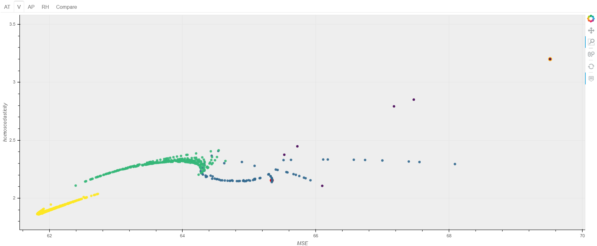

# regVariableConversion

'regVariableConversion' is a Python library for searching "appropriate" variables combination in regression method. Dataset itself is supported multivariate data but relationship between independent variables and dependent variables is one by one. So this library doesn't support interaction effect.

## How to use RVC

## Dependencies
- Numpy
- Pandas
- [Statsmodels](https://github.com/statsmodels/statsmodels)

## Support formula
$$ x, \ x^2, \ x^3, \ \frac{1}{x}, \ \sqrt{x}$$  
$$ logx, \ xlogx, \ x^2logx, \ \frac{logx}{x}, \ \frac{1}{x^2}$$
$$ x\sqrt{x}, \ \sqrt{logx}, \ \sqrt{xlogx} $$

## Search area
a
## Decision algorithm
a

## SubFunction
+ Sliding Function  
If data includes the number can't be converted like log, it'll be slide

+ DataFrame output  
You can choose two types of output. 1.all feature isolated, 2.combined.

+ Regression plot  
You can see how it is improved [matplotlib]

+ Cost plot  
All combination result are plotted [bokeh]

